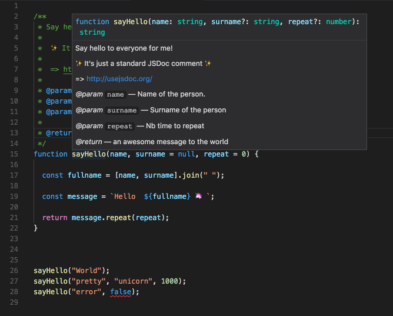
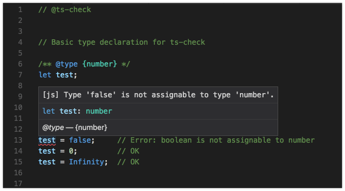

# TS-Check, a static type checker for JavaScript

This project contains the source code used for live coding with ts-check.

> TypeScript 2.3 and later support a mode of type-checking and reporting errors in .js files with --checkJs.

See documentation: https://github.com/Microsoft/TypeScript/wiki/Type-Checking-JavaScript-Files

## Getting started

### Install deps

```bash
npm install
```

### Run TS-Check in standalone mode

```bash
npm run tsc

npm run tsc:watch
```

Open VIM and play with `src/*.js` files

Terminal output:  


### Try TS-Check integrated to VS Code

https://code.visualstudio.com/

Open VS Code and play with `src/*.js` files

Typing error:  


JSDoc comment:  

